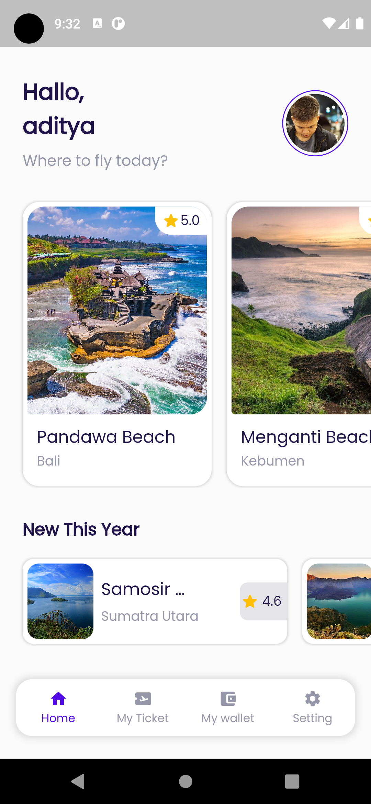
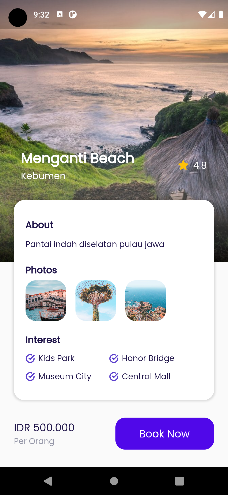
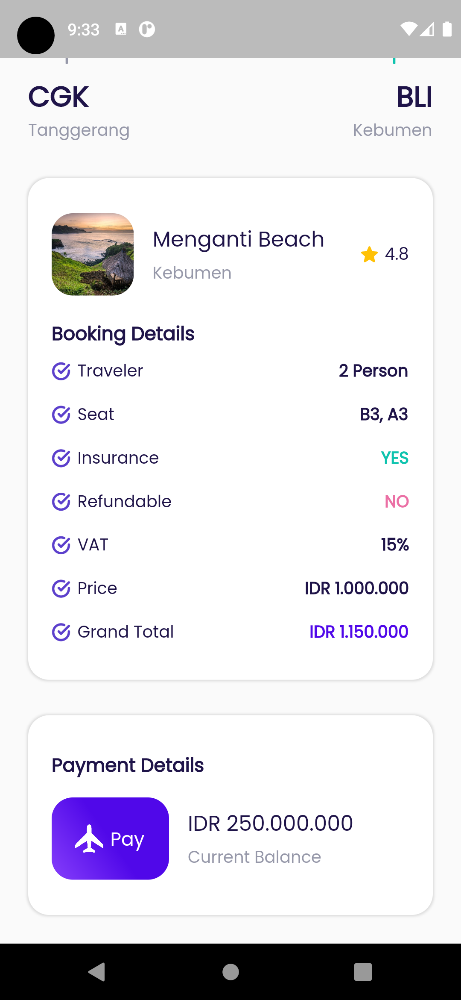

# airplane

flight ticket booking app

with Bloc State Management

## Platform

ios ✔️

android ✔️

## Preview

<!-- <table>
  <tr>
    <td></td>
    <td></td>
    <td></td>
  </tr>
</table> -->

## Development Setup

Clone the repository and run the following commands:

    flutter pub get
    flutter run
